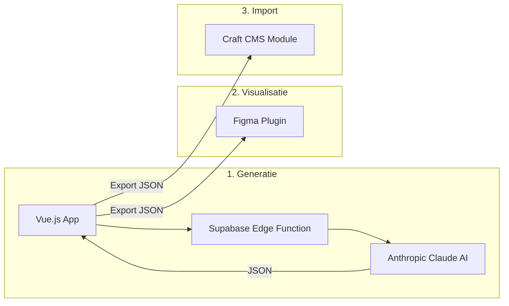
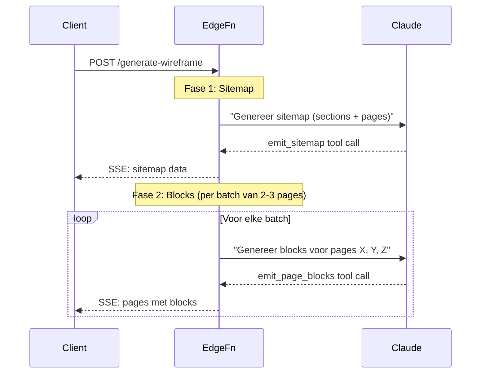
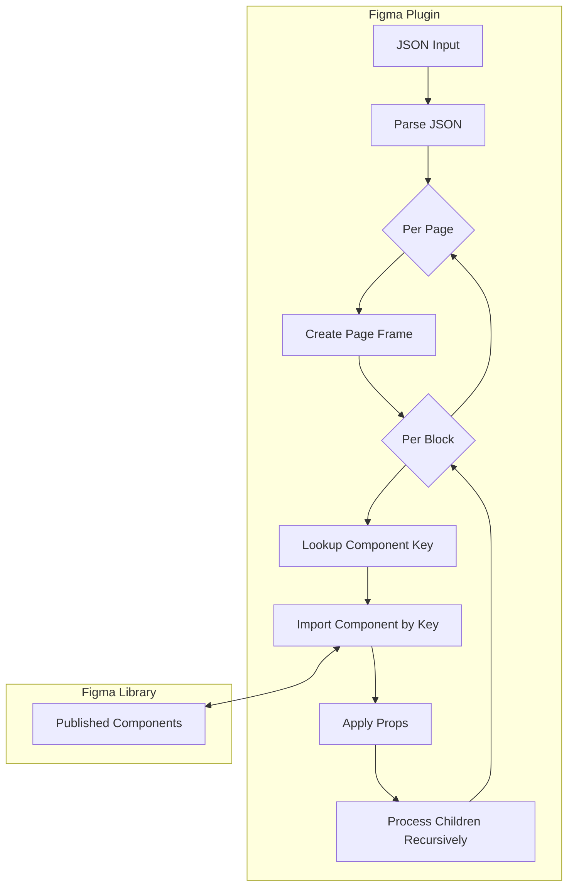
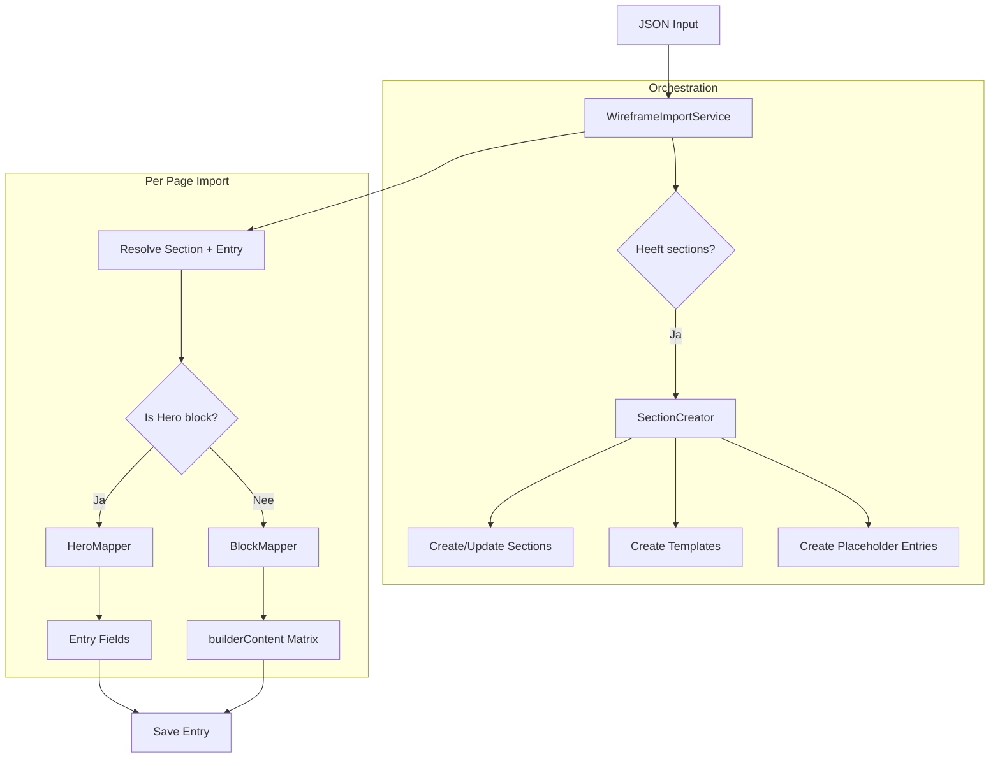
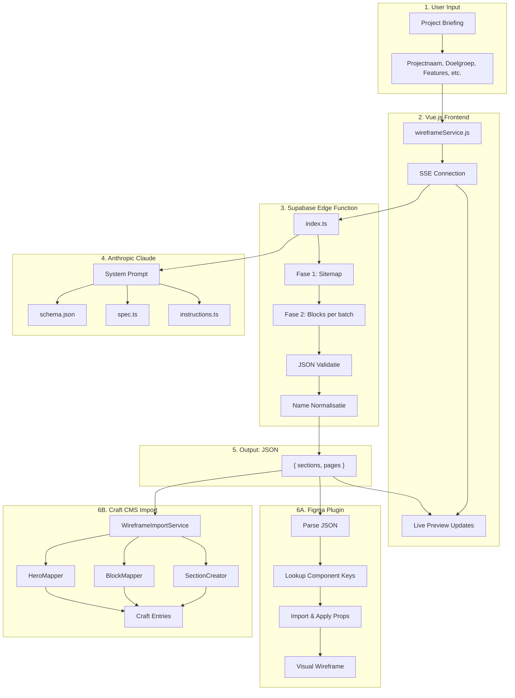

# Wireframe Tool: Technische Documentatie

Dit document legt uit hoe de complete wireframe-pipeline werkt, van AI-generatie tot Craft CMS import, inclusief de Figma plugin. Het is bedoeld als leerdocument voor deep understanding van de architectuur.

---

## Inhoudsopgave

1. [Overzicht: De Complete Pipeline](#overzicht-de-complete-pipeline)
2. [Wireframing Tool (Vue.js Frontend)](#wireframing-tool-vuejs-frontend)
3. [Supabase Edge Function: AI Generatie](#supabase-edge-function-ai-generatie)
4. [Het JSON Schema](#het-json-schema)
5. [Figma Plugin](#figma-plugin)
6. [WireframeImport Module (Craft CMS)](#wireframeimport-module-craft-cms)
7. [Data Flow Diagram](#data-flow-diagram)

---

## Overzicht: De Complete Pipeline

De wireframe-tooling bestaat uit **drie onafhankelijke systemen** die samenwerken via een gedeeld JSON-formaat:



> [!IMPORTANT]
> Het **JSON-formaat** is het centrale contractpunt tussen alle systemen. Elk systeem kan de JSON lezen en verwerken op zijn eigen manier.

---

## Wireframing Tool (Vue.js Frontend)

### Technologie Stack

| Onderdeel        | Technologie                      |
| ---------------- | -------------------------------- |
| Frontend         | Vue.js 3 (Composition API)       |
| State Management | Pinia                            |
| Styling          | Tailwind CSS                     |
| Backend          | Supabase (Edge Functions + Auth) |
| AI               | Anthropic Claude (via Supabase)  |

### Kernbestanden

- [wireframeService.js](file:///c:/Users/jesse/GIT/wireframing-tool/wireframing-tool/src/services/wireframeService.js): Communiceert met de Edge Function via SSE
- [projectService.js](file:///c:/Users/jesse/GIT/wireframing-tool/wireframing-tool/src/services/projectService.js): Lokale opslag van projecten

### Hoe Werkt de Frontend?

```javascript
// wireframeService.js - Vereenvoudigd voorbeeld
generateWireframe(projectData, callbacks = {}) {
  // 1. Bouw request body
  const body = {
    projectName: projectData.projectName,
    companyName: projectData.companyName,
    // ... meer velden
  }

  // 2. Maak SSE (Server-Sent Events) verbinding
  const response = await fetch(supabaseUrl + '/functions/v1/generate-wireframe', {
    method: 'POST',
    headers: { 'Authorization': `Bearer ${supabaseAnonKey}` },
    body: JSON.stringify(body)
  })

  // 3. Lees de stream
  const reader = response.body.getReader()
  while (true) {
    const { done, value } = await reader.read()
    if (done) break

    // Parse de SSE events
    const data = JSON.parse(chunk)
    if (data.type === 'sitemap') callbacks.onSitemap?.(data)
    if (data.type === 'pages') callbacks.onPagesGenerated?.(data)
  }
}
```

**Belangrijke concepten:**

1. **SSE Streaming**: De AI-generatie duurt lang, dus de frontend ontvangt updates via Server-Sent Events
2. **Twee-fasen generatie**: Eerst sitemap (sections + pagina-namen), dan blocks per pagina
3. **Live preview**: Elke batch pages update direct de UI

---

## Supabase Edge Function: AI Generatie

De Edge Function is het hart van de wireframe-generatie. Deze draait op Deno en roept Anthropic Claude aan.

### Kernbestanden

- [index.ts](file:///c:/Users/jesse/GIT/wireframing-tool/wireframing-tool/supabase/functions/generate-wireframe/index.ts): Hoofdlogica (1600+ regels)
- [instructions.ts](file:///c:/Users/jesse/GIT/wireframing-tool/wireframing-tool/supabase/functions/generate-wireframe/instructions.ts): AI instructies in markdown
- [spec.ts](file:///c:/Users/jesse/GIT/wireframing-tool/wireframing-tool/supabase/functions/generate-wireframe/spec.ts): Component specificaties
- [components.schema.json](file:///c:/Users/jesse/GIT/wireframing-tool/wireframing-tool/supabase/functions/generate-wireframe/components.schema.json): JSON Schema validatie

### Twee-Fasen Architectuur

De generatie is opgesplitst in twee fasen om de kwaliteit te verbeteren:



### Fase 1: Sitemap Generatie

```typescript
// Uit index.ts
const sitemapTool = [
  {
    name: "emit_sitemap",
    description:
      "Genereer de sitemap structuur met sections en pagina namen (zonder blokken).",
    input_schema: {
      type: "object",
      properties: {
        sitemap: {
          type: "object",
          properties: {
            sections: { type: "array" /* ... */ },
            pages: { type: "array" /* ... */ },
          },
        },
      },
    },
  },
];
```

De AI wordt gevraagd om:

1. **Sections** te bepalen (single, channel, structure)
2. **Pagina-namen** met rationale (zonder de daadwerkelijke blocks)

### Fase 2: Block Generatie

```typescript
// Uit index.ts
const pageBlocksTool = [
  {
    name: "emit_page_blocks",
    description: "Genereer de blokken voor de opgegeven pagina's.",
    input_schema: {
      type: "object",
      properties: {
        pages: {
          type: "array",
          items: {
            page: string,
            section: string,
            blocks: array,
          },
        },
      },
    },
  },
];
```

Pages worden in **batches van 2-3** gegenereerd om:

- API timeouts te voorkomen
- Snellere feedback te geven
- Retry-mogelijkheden per batch

### AI Prompt Structuur

De AI krijgt een **system prompt** opgebouwd uit:

1. **`INSTRUCTIONS_MD`** - Werkwijze en beslisregels
2. **`SPEC_MD`** - Component specificaties
3. **`components.schema.json`** - JSON Schema voor validatie

```typescript
// Vereenvoudigd uit index.ts
const systemPrompt = `
${INSTRUCTIONS_MD}

# Component Specificaties
${SPEC_MD}

# JSON Schema (voor validatie)
${JSON.stringify(componentsSchema)}
`;
```

### Retry Logica

De Edge Function heeft robuuste retry-logica voor:

- **529 Overloaded**: Claude API overbelast
- **Network errors**: Tijdelijke verbindingsproblemen
- **Timeouts**: Lange generatietijden

```typescript
async function retryWithBackoff<T>(
  fn: () => Promise<T>,
  options: {
    maxRetries?: number; // default: 3
    initialDelayMs?: number; // default: 1000
    maxDelayMs?: number; // default: 30000
  }
): Promise<T>;
```

### Component Name Normalisatie

De AI maakt soms fouten in componentnamen. De Edge Function corrigeert deze:

```typescript
const COMPONENT_NAME_MAP = {
  ButtonPrimary: "Button Primary",
  "button primary": "Button Primary",
  "Detail page": "Detailpage",
  Detailpage: "Detailpage",
  // ... meer mappings
};
```

---

## Het JSON Schema

Het JSON-formaat is het contractpunt tussen alle systemen. Het schema definieert:

### Top-Level Structuur

```json
{
  "sections": [
    {
      "name": "Home",
      "handle": "homePage",
      "type": "single",
      "slug": "home",
      "template": "_pages/home/entry.twig",
      "entryTypes": ["homePage"]
    },
    {
      "name": "Nieuws",
      "handle": "news",
      "type": "channel",
      "slug": "nieuws/{slug}",
      "template": "_pages/news/entry.twig",
      "fetchesFrom": null
    }
  ],
  "pages": [
    {
      "page": "Home",
      "section": "homePage",
      "rationale": "Landing page met hero, diensten grid en CTA",
      "blocks": [
        /* ... */
      ]
    }
  ]
}
```

### Section Types

| Type        | Gebruik                           | Voorbeeld                 |
| ----------- | --------------------------------- | ------------------------- |
| `single`    | Unieke pagina's                   | Home, Contact, Over ons   |
| `channel`   | Stream van gelijksoortige content | Nieuws, Blog, Vacatures   |
| `structure` | Hiërarchische boomstructuur       | Diensten met sub-diensten |

### Block Structuur

Elk block heeft dezelfde basis-structuur:

```json
{
  "component": "Hero",
  "props": {
    "Has Title": true,
    "Hero Title": "Welkom bij ons bedrijf",
    "Has Description": true,
    "Description": "Wij helpen u graag verder"
  },
  "children": [
    {
      "component": "Button Primary",
      "props": {
        "Property 1": "Default",
        "Text primary button": "Meer info"
      }
    }
  ]
}
```

**Belangrijke velden:**

- `component`: Exacte componentnaam (moet matchen met Figma en Craft)
- `props`: Object met alle property-waarden
- `children`: Geneste componenten (buttons, cards, etc.)
- `blockType`: `"staticContent"` of `"entrySection"` (voor dynamische content)
- `fetchesFrom`: Section handle voor entrySection blocks

### Beschikbare Componenten

```
TopLevelComponent:
├── Hero
├── MediaGroot
├── Kolommen
├── MediaSlider
├── Grid
├── EntryPostSlider
├── LogoSlider
├── CalltoAction
├── Footer
├── Grid2Col
├── Grid3Col
├── Form
├── Contactform
└── Detailpage
```

---

## Figma Plugin

De Figma plugin converteert JSON naar visuele Figma componenten.

### Kernbestanden

- [manifest.json](file:///c:/Users/jesse/GIT/wireframePlugin/figma-plugin/manifest.json): Plugin configuratie
- [dist/code.js](file:///c:/Users/jesse/GIT/wireframePlugin/figma-plugin/dist/code.js): Plugin logica
- [ui.html](file:///c:/Users/jesse/GIT/wireframePlugin/figma-plugin/ui.html): UI voor de plugin

### Hoe Werkt Het?



### Component Key Mapping

De plugin heeft een **hardcoded mapping** van componentnamen naar Figma keys:

```javascript
// Uit code.js
var mapping = {
  CalltoAction: "8a16e7ae870332d3ee5dee0b0a7bbe36161b78e4",
  EntryPostSlider: "f6e67fbecfc8796ca7ec65ddaa9f6cc81cea0b7d",
  Footer: "a86d31be91c7e1072a2c3b7ea9f3420087fae45c",
  Grid: "3a59b3a1b88c31b18a7518a28fd1bdbfe4578c5e",
  Hero: "b32b45808374ab06b22672b9b96483c7a1c550db",
  // ...
};
```

> [!TIP]
> De **Component Keys tab** in de plugin kan nieuwe mappings genereren vanuit het Boilerplate Figma bestand.

### Props Toepassen

De plugin matcht JSON props met Figma component properties:

```javascript
function setPropsOnInstance(instance, props, compPath) {
  var nameToId = buildNameToIdFromInstance(instance);
  var toSet = {};

  for (var key in props) {
    if (nameToId[key]) {
      toSet[nameToId[key]] = props[key];
    }
  }

  instance.setProperties(toSet);
}
```

**Uitdaging**: Figma property IDs bevatten hashes (bijv. `"Has Title#123:456"`), terwijl JSON alleen de naam heeft (`"Has Title"`). De functie `buildNameToIdFromInstance` lost dit op.

### Recursive Children Processing

```javascript
async function applySpecToInstance(instance, spec, pathLabel) {
  // 1. Apply props
  if (spec.props) setPropsOnInstance(instance, spec.props)

  // 2. Process children
  if (spec.children) {
    for (var ci = 0; ci < spec.children.length; ci++) {
      var child = spec.children[ci]

      // Find nested instances with matching component name
      var matches = await findNestedInstances(instance, child.component)

      if (typeof child.index === 'number') {
        // Apply to specific index (bijv. "Inner Grid Card" index 0)
        await applySpecToInstance(matches[child.index], child, ...)
      } else {
        // Apply to first match
        await applySpecToInstance(matches[0], child, ...)
      }
    }
  }
}
```

---

## WireframeImport Module (Craft CMS)

De Craft CMS module importeert wireframe JSON naar echte Craft entries.

### Module Structuur

```
modules/wireframeImport/
├── Module.php                    # Entry point
├── controllers/
│   └── ImportController.php      # HTTP controller
├── console/
│   └── controllers/
│       └── ImportController.php  # CLI controller
└── services/
    ├── WireframeImportService.php  # Orchestrator
    ├── SectionCreator.php          # Sections/templates
    ├── BlockMapper.php             # JSON → Matrix blocks
    ├── HeroMapper.php              # Hero naar Entry velden
    ├── ComponentRegistry.php       # Component configuratie
    └── ButtonHelper.php            # Button utilities
```

### Service Architectuur



### ComponentRegistry

De [ComponentRegistry.php](file://wsl.localhost/Ubuntu-22.04/home/jesse/projects/Boilerplate/craft-starter/modules/wireframeImport/services/ComponentRegistry.php) definieert de mapping van Figma componenten naar Craft block types:

```php
public const COMPONENT_MAP = [
    // Hero wordt apart behandeld (niet in builderContent)
    'Hero' => [
        'craftType' => 'hero',
        'handler' => 'hero',
        'description' => 'Hero sectie - wordt gemapped naar Entry velden',
    ],

    // Kolommen blok
    'Kolommen' => [
        'craftType' => 'blockColumns',
        'handler' => 'columns',
        'requiredFields' => ['columns'],
    ],

    // Grid met statische content
    'Grid' => [
        'craftType' => 'blockStaticContent',
        'handler' => 'staticContent',
        'fieldDefaults' => ['contentComposition' => 'grid'],
    ],

    // Entry sections (dynamische content)
    'Grid2Col' => [
        'craftType' => 'blockEntrySection',
        'handler' => 'entrySection',
        'fieldDefaults' => ['allEntryBlocks' => 'related'],
    ],

    // Skip componenten
    'Footer' => [
        'craftType' => 'skip',
        'handler' => 'skip',
        'description' => 'Footer - wordt overgeslagen (is Global Set)',
    ],
];
```

### SectionCreator

De [SectionCreator.php](file://wsl.localhost/Ubuntu-22.04/home/jesse/projects/Boilerplate/craft-starter/modules/wireframeImport/services/SectionCreator.php) maakt Craft sections programmatisch aan:

```php
public function createOrUpdateSection(array $sectionData): array
{
    // 1. Check of section al bestaat
    $existing = Craft::$app->getSections()->getSectionByHandle($handle);

    if (!$existing) {
        // 2. Maak nieuwe section
        $section = new Section();
        $section->name = $sectionData['name'];
        $section->handle = $sectionData['handle'];
        $section->type = $this->getSectionType($sectionData['type']);
        // ...

        // 3. Maak entry type
        $entryType = new EntryType();
        $entryType->handle = $handle;
        // Clone field layout van template entry type
        $entryType->setFieldLayout($this->cloneFieldLayout($sourceLayout));

        // 4. Save section
        Craft::$app->getSections()->saveSection($section);
    }

    // 5. Maak template bestand
    $this->createTemplate($sectionData['template']);

    // 6. Maak placeholder entries (voor channels)
    if ($sectionData['type'] === 'channel') {
        $this->createPlaceholderEntries($section, $entryType, 3);
    }
}
```

### BlockMapper

De [BlockMapper.php](file://wsl.localhost/Ubuntu-22.04/home/jesse/projects/Boilerplate/craft-starter/modules/wireframeImport/services/BlockMapper.php) transformeert JSON blocks naar Craft Matrix data:

```php
public function transformToBuilderContent(array $blocks): array
{
    $matrixData = ['sortOrder' => [], 'blocks' => []];

    foreach ($blocks as $block) {
        $componentName = $block['component'] ?? null;
        $config = Module::getInstance()->componentRegistry->getComponentConfig($componentName);

        if ($config['handler'] === 'skip') continue;
        if ($config['handler'] === 'hero') continue; // Handled by HeroMapper

        // Call the appropriate handler method
        $entryData = match($config['handler']) {
            'columns' => $this->handleColumns($block),
            'staticContent' => $this->handleStaticContent($block),
            'entrySection' => $this->handleEntrySection($block),
            'callToAction' => $this->handleCallToAction($block),
            default => null,
        };

        if ($entryData) {
            $matrixData['sortOrder'][] = 'new:' . $blockId;
            $matrixData['blocks']['new:' . $blockId] = $entryData;
        }
    }

    return $matrixData;
}
```

### Kolommen Blok Verwerking

Een `Kolommen` component wordt omgezet naar een `blockColumns` entry met geneste `columns` Matrix:

```php
private function handleColumns(array $block): array
{
    $columns = $this->transformColumnsChildren($block['children'] ?? []);

    return [
        'type' => 'blockColumns',
        'enabled' => true,
        'fields' => [
            'columnsReversed' => $block['props']['Property 1'] === 'Variant2',
            'columns' => $columns, // Nested Matrix
        ],
    ];
}

private function transformColumnsChildren(array $children): array
{
    $columnData = [];

    foreach ($children as $child) {
        switch ($child['component']) {
            case 'Media':
                $columnData[] = $this->createMediaColumn($child['props']);
                break;
            case 'Content Kolommen Block':
                // Check of het tekst of accordion is
                if ($child['props']['Has Accordion'] ?? false) {
                    $columnData[] = $this->createAccordionColumn(...);
                } else {
                    $columnData[] = $this->createTextColumn(...);
                }
                break;
        }
    }

    return $columnData;
}
```

### HeroMapper

De [HeroMapper.php](file://wsl.localhost/Ubuntu-22.04/home/jesse/projects/Boilerplate/craft-starter/modules/wireframeImport/services/HeroMapper.php) zet Hero data om naar Entry-level velden (niet Matrix):

```php
public function mapHeroToEntry(Entry $entry, array $heroBlock): void
{
    $props = $heroBlock['props'] ?? [];

    // Titel en beschrijving
    $entry->setFieldValue('heroTitle', $props['Hero Title'] ?? null);
    $entry->setFieldValue('heroDescription', $props['Description'] ?? null);

    // USPs als nested entries (CKEditor)
    if ($props['Has Usps'] ?? false) {
        $usps = [
            $props['Usp 1'] ?? '',
            $props['Usp 2'] ?? '',
            $props['Usp 3'] ?? '',
        ];
        $this->createUspsEntry($entry, $usps);
    }

    // Buttons
    $this->mapHeroButtons($entry, $heroBlock['children'] ?? []);
}
```

---

## Data Flow Diagram

Dit diagram toont de complete flow van gebruikersinput tot Craft CMS content:



---

## Belangrijke Concepten Samengevat

### 1. JSON als Contractpunt

Alle systemen delen hetzelfde JSON-formaat. Dit maakt het mogelijk om:

- Onafhankelijk te ontwikkelen
- Makkelijk te debuggen (JSON is leesbaar)
- Backward compatible te zijn

### 2. Twee-Fasen AI Generatie

Door sitemap en blocks apart te genereren:

- Betere kwaliteit (AI kan focussen)
- Snellere feedback (sitemap direct zichtbaar)
- Robuuster (retry per batch)

### 3. Component Registry Pattern

Zowel de Figma plugin als Craft CMS gebruiken een registry om:

- Component mapping centraal te beheren
- Onbekende componenten te detecteren
- Handlers per component type te definiëren

### 4. Sections-First in Craft

De import maakt EERST sections aan, dan pas entries:

- Sectie-configuratie komt uit de JSON
- Entry types krijgen het juiste field layout
- Templates worden automatisch aangemaakt

---

## Praktische Tips

### Debuggen van AI Output

1. Check de SSE events in de browser DevTools (Network tab)
2. Kijk naar de `rationale` per pagina
3. Valideer JSON tegen het schema

### Nieuwe Component Toevoegen

1. **Schema**: Voeg toe aan `components.schema.json`
2. **Spec**: Documenteer in `spec.ts`
3. **Instructions**: Update beslisregels in `instructions.ts`
4. **Figma**: Maak component en update mapping
5. **Craft**: Voeg toe aan `ComponentRegistry.php` en maak handler

### Veelvoorkomende Problemen

| Probleem                 | Oorzaak                | Oplossing                                |
| ------------------------ | ---------------------- | ---------------------------------------- |
| Lege blocks              | AI timeout             | Check retry logica, vergroot batch delay |
| Verkeerde component naam | AI hallucineert        | Voeg toe aan `COMPONENT_NAME_MAP`        |
| Figma import faalt       | Key niet gevonden      | Update mapping in `code.js`              |
| Craft import mist velden | Field layout verschilt | Clone vanaf juiste template entry type   |

---

_Laatste update: Januari 2026_
